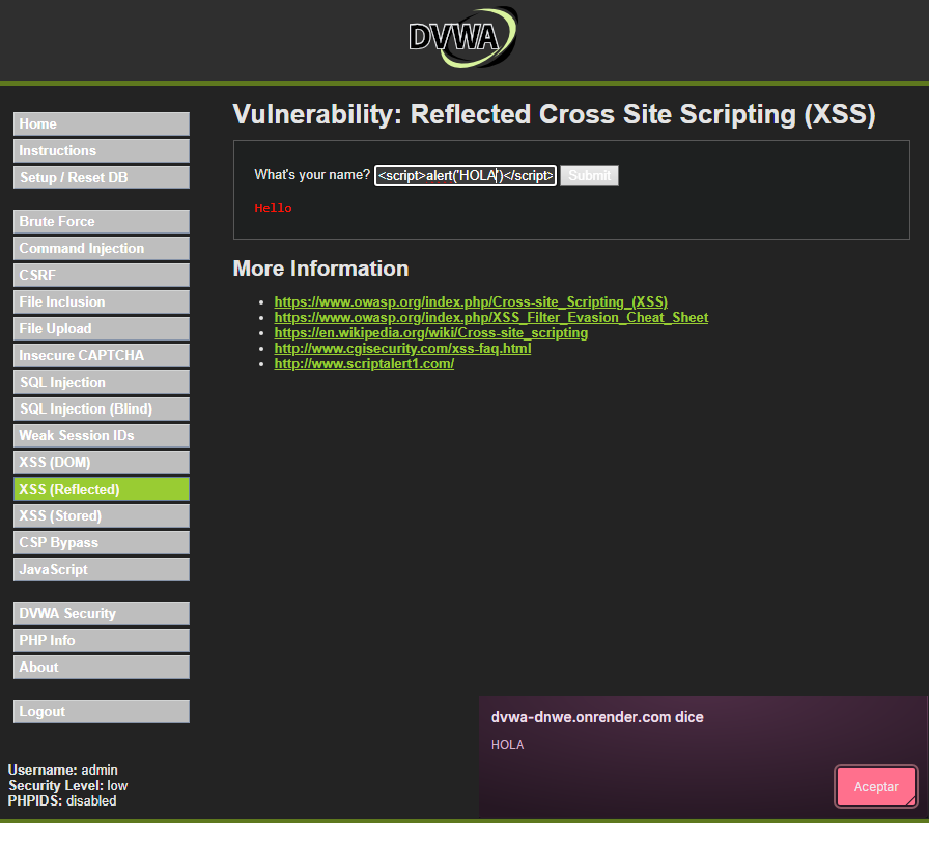

# 03. Análisis de vulnerabilidad: XSS reflejado

## Inmobiliaria Terranova — Portal de clientes

## 1. Resumen del hallazgo

Se evaluó la vulnerabilidad **Cross-Site Scripting reflejado**, también conocida como **XSS Reflected**. La prueba permitió demostrar cómo una aplicación vulnerable puede recibir una entrada del usuario y devolverla en la respuesta HTML sin validarla, sanitizarla o codificarla correctamente.

En el contexto de Inmobiliaria Terranova, una vulnerabilidad de XSS reflejado en el portal de clientes podría permitir que un atacante induzca a un usuario a ejecutar código no confiable en su navegador. Esto puede afectar la confianza del cliente en la plataforma, facilitar suplantación visual, manipular contenido del portal, capturar información ingresada en formularios o interferir con la sesión del usuario.

Aunque el XSS reflejado no compromete directamente la base de datos como una Inyección SQL, sí representa un riesgo importante porque ataca la interacción entre el usuario y el portal. En una plataforma inmobiliaria donde los clientes consultan contratos, estados de pago y antecedentes financieros, la manipulación del navegador puede tener consecuencias relevantes para la confidencialidad, integridad de la interacción y reputación institucional.

## 2. ¿Qué es XSS reflejado?

El XSS reflejado es una vulnerabilidad web que ocurre cuando una aplicación recibe datos desde una solicitud del usuario y los devuelve inmediatamente en la página de respuesta sin aplicar controles adecuados.

En una aplicación segura, cualquier dato ingresado por el usuario debe tratarse como contenido no confiable. El problema aparece cuando la aplicación inserta ese dato dentro del HTML de respuesta y el navegador lo interpreta como código ejecutable.

## 3. Causa raíz de la vulnerabilidad

La causa raíz del XSS reflejado es la falta de control sobre los datos que la aplicación recibe y devuelve al navegador.

La vulnerabilidad aparece cuando se combinan tres condiciones:

1. La aplicación recibe datos ingresados por el usuario.
2. La aplicación devuelve esos datos dentro del HTML de respuesta.
3. El navegador interpreta esos datos como código ejecutable.

La falla no está solamente en que el usuario pueda escribir código, sino en que la aplicación no controla correctamente cómo se muestra ese contenido en la página.

### Causas frecuentes

* No validar entradas del usuario.
* No codificar la salida antes de insertarla en HTML.
* Insertar contenido del usuario directamente en la página.
* No sanitizar contenido cuando se permite HTML controlado.
* No aplicar políticas de seguridad del navegador.
* No diferenciar entre datos y código ejecutable.
* Falta de revisión de seguridad en formularios, parámetros de URL o mensajes reflejados.
* Confianza excesiva en la entrada enviada por el usuario.


## 4. Puntos de entrada donde puede aparecer

En el portal de clientes de Inmobiliaria Terranova, una vulnerabilidad XSS reflejada podría aparecer en cualquier funcionalidad donde la aplicación reciba un dato y lo muestre nuevamente en pantalla.

| Punto de entrada           | Ejemplo en el portal                                   | Riesgo asociado                                  |
| -------------------------- | ------------------------------------------------------ | ------------------------------------------------ |
| Buscador de contratos      | Campo para buscar contrato por número o palabra clave  | Manipulación del resultado mostrado al cliente.  |
| Formulario de contacto     | Mensaje enviado por el usuario y reflejado en pantalla | Ejecución de código en el navegador del usuario. |
| Parámetros de URL          | Mensajes como `?error=...` o `?busqueda=...`           | Creación de enlaces manipulados.                 |
| Filtros de estados de pago | Búsqueda por estado, fecha o cliente                   | Reflejo inseguro del texto ingresado.            |
| Mensajes de error          | Respuesta que muestra el dato ingresado                | Exposición de comportamiento inseguro.           |
| Panel de seguimiento       | Respuesta dinámica con información del cliente         | Manipulación visual de información sensible.     |


### Ejecución utilizada

```html
<script>alert('HOLA')</script>
```

Esta ejecución permite comprobar si la aplicación refleja la entrada del usuario sin codificarla correctamente. Si la aplicación es vulnerable, el navegador interpreta la entrada como código JavaScript y ejecuta una alerta.

### Captura de evidencia



### Resultado observado

El resultado observado demuestra que la aplicación devuelve la entrada ingresada y permite que el navegador ejecute el código JavaScript. La aparición de la alerta confirma que el contenido fue interpretado como código ejecutable y no como texto seguro.

En el portal de clientes de Inmobiliaria Terranova, una vulnerabilidad equivalente podría permitir que un atacante construya enlaces manipulados o entradas maliciosas para afectar la experiencia del cliente dentro del portal.

### Flujo técnico del ataque

1. El usuario ingresa o recibe una URL con un parámetro manipulado.
2. La aplicación procesa el parámetro recibido.
3. La aplicación devuelve el valor ingresado en la respuesta HTML.
4. El navegador interpreta el valor como código.
5. El código se ejecuta en el navegador de la víctima.

### Principio de seguridad vulnerado

El principio vulnerado es:

```text
Toda entrada del usuario debe considerarse no confiable.
```

La aplicación no debe insertar directamente datos del usuario en la página sin aplicar controles de salida adecuados según el contexto donde serán mostrados.

## 5. Impacto en Inmobiliaria Terranova

El impacto de XSS reflejado se analiza según los tres pilares de la seguridad de la información: confidencialidad, integridad y disponibilidad.

### 5.1 Confidencialidad

La confidencialidad puede verse afectada si el atacante logra ejecutar código en el navegador del cliente y acceder a información visible dentro de la sesión del usuario.

En Inmobiliaria Terranova, esto podría afectar:

* Datos personales visibles en el portal.
* Información de contratos consultados por el cliente.
* Estados de pago.
* Información financiera presentada en pantalla.
* Datos ingresados en formularios.
* Elementos de sesión expuestos al navegador.

El riesgo aumenta si el portal no aplica controles adecuados de sesión, cabeceras de seguridad o protección contra lectura indebida de datos del cliente.

### 5.2 Integridad

La integridad puede verse afectada porque el código ejecutado en el navegador podría modificar la forma en que el usuario visualiza la página.

En el contexto del portal, esto podría permitir:

* Alterar visualmente mensajes del portal.
* Mostrar instrucciones falsas al cliente.
* Simular formularios fraudulentos.
* Manipular información visible en pantalla.
* Redirigir al usuario a flujos engañosos.
* Afectar la confianza en los datos mostrados.

Aunque el XSS reflejado no modifica necesariamente la base de datos, sí puede alterar la interacción del usuario con el sistema.

### 5.3 Disponibilidad

El impacto sobre disponibilidad suele ser menor que en otros ataques. Sin embargo, puede existir afectación parcial si el código ejecutado interrumpe la navegación, bloquea componentes visuales o degrada la experiencia del usuario.

En el portal de Inmobiliaria Terranova, esto podría causar:

* Errores visuales.
* Bloqueo de formularios.
* Interrupción de consultas.
* Pérdida de confianza en el uso del portal.

## 6. Activos afectados

Los principales activos afectados por este hallazgo son:

| Activo                     | Descripción                                                         | Nivel de criticidad |
| -------------------------- | ------------------------------------------------------------------- | ------------------- |
| Sesión del cliente         | Interacción activa del usuario dentro del portal.                   | Alto                |
| Portal de clientes         | Canal de consulta de contratos y datos financieros.                 | Alto                |
| Datos visibles en pantalla | Información contractual, financiera o personal mostrada al usuario. | Alto                |
| Formularios del portal     | Campos donde el cliente ingresa información.                        | Medio               |
| Confianza institucional    | Percepción de seguridad y seriedad de la empresa.                   | Alto                |
| Imagen corporativa         | Reputación digital de la inmobiliaria frente a clientes.            | Alto                |

## 7. Amenaza asociada

La amenaza asociada corresponde a un atacante que busca ejecutar código en el navegador de un usuario del portal mediante una entrada o enlace manipulado.

Posibles actores de amenaza:

* Usuario externo que envía enlaces manipulados.
* Cliente con cuenta válida que intenta afectar a otros usuarios.
* Atacante que busca suplantar información del portal.
* Actor que intenta manipular formularios o mensajes visibles.
* Atacante que busca afectar la confianza en la plataforma.

## 8. Evaluación de gravedad mediante CVSS v3.1

Para estimar la gravedad del hallazgo se utiliza CVSS v3.1, considerando que se trata de un XSS reflejado en un portal web de clientes.

### Vector CVSS propuesto

```text
CVSS:3.1/AV:N/AC:L/PR:N/UI:R/S:C/C:L/I:L/A:N
```

### Puntaje base estimado

```text
6.1 — Medio
```

### Justificación del vector

| Métrica | Valor    | Justificación                                                                                                           |
| ------- | -------- | ----------------------------------------------------------------------------------------------------------------------- |
| AV:N    | Network  | La vulnerabilidad se explota a través de una aplicación web accesible por red.                                          |
| AC:L    | Low      | No requiere condiciones técnicas complejas si el parámetro vulnerable está disponible.                                  |
| PR:N    | None     | El atacante no requiere privilegios si puede construir un enlace o entrada reflejada accesible.                         |
| UI:R    | Required | Requiere que la víctima interactúe con el enlace o solicitud manipulada.                                                |
| S:C     | Changed  | El impacto se produce en el navegador del usuario, cambiando el contexto afectado respecto de la aplicación vulnerable. |
| C:L     | Low      | Puede exponer información visible en la sesión o facilitar captura de datos ingresados.                                 |
| I:L     | Low      | Puede manipular contenido mostrado o inducir acciones engañosas.                                                        |
| A:N     | None     | No se considera afectación directa de disponibilidad del servidor.                                                      |

### Severidad asignada

La severidad técnica se clasifica como **Media**.

### Interpretación para el negocio

Aunque el puntaje CVSS técnico es medio, el riesgo para Inmobiliaria Terranova puede ser **alto** si el XSS se aprovecha en secciones donde los clientes consultan contratos, datos financieros o información personal. Esto se debe a que la explotación puede afectar la confianza del cliente, la privacidad de la sesión y la integridad de la experiencia dentro del portal.


## 9. Nivel de riesgo para Inmobiliaria Terranova

El riesgo se estima considerando:

```text
Riesgo = Probabilidad × Impacto
```

### Probabilidad

**Media-alta.**
La probabilidad se considera media-alta porque el XSS reflejado requiere interacción de la víctima, pero puede distribuirse mediante enlaces, mensajes o parámetros manipulados.

### Impacto

**Alto.**
El impacto se considera alto porque el portal de clientes muestra información relevante, como contratos, estados de pago y antecedentes financieros. La manipulación del navegador puede afectar la confianza del usuario y exponer información durante la sesión.

### Nivel de riesgo resultante

```text
Riesgo alto
```

### Prioridad de remediación

```text
Prioridad 2 — Corrección alta
```

La vulnerabilidad debe corregirse con alta prioridad, especialmente si se encuentra en funcionalidades visibles para clientes o en secciones donde se consulta información contractual o financiera.

---

## 10. Política de prevención propuesta

### Política: Control de entradas y codificación segura de salida

Inmobiliaria Terranova debe implementar una política de desarrollo seguro que exija validar entradas y codificar toda salida generada a partir de datos ingresados por usuarios.

La política debe establecer que ningún dato recibido desde formularios, parámetros de URL, buscadores o mensajes puede ser insertado directamente en una página HTML sin aplicar controles adecuados según el contexto.

### Lineamientos de prevención

1. Toda entrada del usuario debe considerarse no confiable.
2. Los datos reflejados en páginas HTML deben ser codificados antes de mostrarse.
3. Se debe aplicar codificación contextual según el lugar donde se inserta el dato: HTML, atributo, JavaScript, CSS o URL.
4. Los formularios y parámetros de URL deben validar tipo, longitud y formato.
5. No se debe insertar contenido del usuario mediante funciones inseguras que interpreten HTML.
6. Se debe implementar una política Content Security Policy como control complementario.
7. Las cookies de sesión deben usar atributos de seguridad como HttpOnly, Secure y SameSite.
8. Los mensajes de error o confirmación no deben reflejar contenido no controlado.
9. Todo cambio en vistas o componentes que rendericen datos del usuario debe pasar por revisión de seguridad.
10. Se deben realizar pruebas específicas de XSS en formularios, filtros, mensajes y parámetros de URL.

## 11. Control de mitigación propuesto

### Control principal

```text
Aplicar codificación de salida contextual en todo contenido generado con datos del usuario.
```

La codificación de salida convierte caracteres potencialmente interpretables como código en representaciones seguras para el navegador. Esto permite que el contenido se muestre como texto y no como instrucciones ejecutables.

## 12. Ejemplo de corrección segura

Una práctica insegura es insertar directamente datos del usuario dentro de una página HTML.

```text
Mostrar en pantalla: "Hola " + entrada_usuario
```

Si `entrada_usuario` contiene código y la aplicación lo interpreta como HTML, se produce el riesgo de XSS.

Una práctica segura consiste en codificar la salida antes de mostrarla.

```text
Mostrar entrada_usuario como texto seguro, no como HTML ejecutable.
```

En frameworks modernos, se deben evitar funciones que inserten HTML sin control. Si por necesidad se permite HTML, debe aplicarse sanitización estricta con librerías confiables y reglas claras.

### Eventos que deben registrarse

* Parámetros de URL con etiquetas HTML o scripts.
* Entradas con caracteres especiales repetidos.
* Intentos de inyección en formularios de búsqueda.
* Mensajes que incluyan patrones sospechosos.
* Errores de validación asociados a contenido no permitido.
* Actividad anómala en sesiones de clientes.
* Repetición de solicitudes con payloads similares.

## 13. Actos a seguir posterior al ataque

Se recomienda aplicar el siguiente plan de remediación:

1. Identificar todos los puntos donde el portal refleja datos ingresados por el usuario.
2. Revisar formularios, buscadores, filtros, mensajes de error y parámetros de URL.
3. Implementar codificación de salida contextual.
4. Validar tipo, longitud y formato de las entradas.
5. Evitar inserciones directas de HTML generado por usuarios.
6. Implementar Content Security Policy.
7. Asegurar cookies con HttpOnly, Secure y SameSite.
8. Revisar componentes frontend que renderizan datos dinámicos.
9. Ejecutar pruebas de seguridad para confirmar que el payload ya no se ejecuta.
10. Documentar la corrección y actualizar la política de desarrollo seguro.

## 14. Medidas posteriores si el ataque ocurre

Si se detecta explotación real de XSS reflejado en el portal de clientes, la empresa debe aplicar un proceso de respuesta.

### Acciones recomendadas

1. Contener el incidente, bloqueando temporalmente el parámetro o formulario vulnerable.
2. Preservar evidencia, incluyendo URL manipuladas, logs, capturas y reportes de usuarios.
3. Identificar si algún cliente interactuó con enlaces maliciosos.
4. Revisar si hubo exposición de datos personales, contractuales o financieros visibles en sesión.
5. Invalidar sesiones potencialmente comprometidas.
6. Reforzar cookies de sesión con atributos de seguridad.
7. Corregir el punto vulnerable con codificación de salida contextual.
8. Implementar o endurecer Content Security Policy.
9. Informar a responsables internos de seguridad, soporte y área legal.
10. Notificar a clientes si corresponde por posible afectación de datos.
11. Documentar lecciones aprendidas y mejorar controles de desarrollo seguro.

## 15. Conclusión del hallazgo

El XSS reflejado representa un hallazgo de severidad técnica media, pero con riesgo alto para Inmobiliaria Terranova debido al tipo de información que sus clientes consultan en el portal.

La prueba realizada en DVWA demuestra que una aplicación vulnerable puede reflejar una entrada del usuario y provocar la ejecución de código en el navegador. En el contexto del portal de clientes, esto podría permitir manipulación visual, suplantación de mensajes, afectación de sesiones y exposición indirecta de datos consultados por el usuario.

La medida preventiva más importante es aplicar codificación de salida contextual, complementada con validación de entradas, sanitización segura cuando corresponda, Content Security Policy, cookies seguras, monitoreo y pruebas de seguridad.

Este hallazgo debe corregirse con alta prioridad en cualquier sección del portal donde se refleje información ingresada por usuarios, especialmente en módulos relacionados con búsqueda de contratos, estados financieros, formularios de contacto o mensajes del sistema.

## 16. Fuentes de apoyo utilizadas

* OWASP — Cross-Site Scripting Prevention Cheat Sheet.
* OWASP — Web Security Testing Guide: Testing for Reflected Cross Site Scripting.
* OWASP — Cross Site Scripting.
* FIRST — Common Vulnerability Scoring System v3.1 Calculator.
* FIRST — CVSS v3.1 Specification.
* Material de clases de la Unidad 3 — Evaluación de Vulnerabilidades y Matriz de Riesgo.
