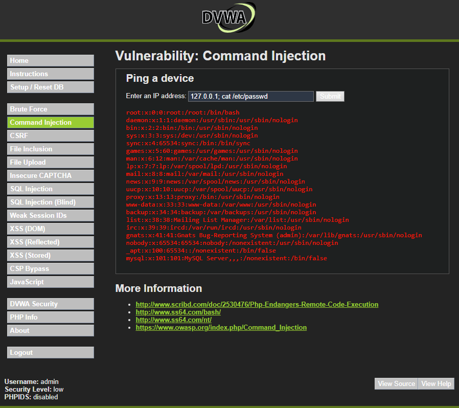

# 04. Análisis de vulnerabilidad: Inyección de comandos

## Inmobiliaria Terranova — Portal de clientes

## 1. Resumen del hallazgo

En el contexto de Inmobiliaria Terranova, este hallazgo representa uno de los riesgos más graves para el portal de clientes, debido a que puede comprometer directamente el servidor que soporta la aplicación. Si una vulnerabilidad equivalente existiera en el portal productivo, un atacante podría ejecutar comandos no autorizados, acceder a archivos internos, afectar la disponibilidad del sistema, alterar información o comprometer la infraestructura donde se administran contratos y datos financieros de clientes.

A diferencia de vulnerabilidades que afectan solo la base de datos o el navegador del usuario, la Inyección de comandos puede impactar directamente el sistema operativo del servidor. Por esta razón, su análisis debe considerarse crítico dentro de una auditoría de seguridad web.

## 2. ¿Qué es la Inyección de comandos?

La Inyección de comandos es una vulnerabilidad que ocurre cuando una aplicación permite que datos ingresados por el usuario sean interpretados como comandos del sistema operativo.

En una aplicación segura, los datos ingresados por el usuario deben ser tratados únicamente como información. El problema aparece cuando la aplicación toma esa entrada y la incorpora directamente en una instrucción que será ejecutada por el servidor.

## 3. Diferencia entre Inyección SQL e Inyección de comandos

| Vulnerabilidad        | Componente afectado            | Ejemplo de impacto                                                             |
| --------------------- | ------------------------------ | ------------------------------------------------------------------------------ |
| Inyección SQL         | Base de datos                  | Exposición o modificación de registros, contratos o datos financieros.         |
| XSS reflejado         | Navegador del usuario          | Ejecución de código en la sesión del cliente.                                  |
| Inyección de comandos | Sistema operativo del servidor | Ejecución de comandos, lectura de archivos internos o compromiso del servidor. |

La Inyección de comandos suele considerarse más grave porque puede permitir interacción directa con el sistema operativo donde se ejecuta la aplicación.


## 4. Causa raíz de la vulnerabilidad

La causa raíz de la Inyección de comandos es la mezcla insegura entre:

```text
Datos ingresados por el usuario + comandos del sistema operativo
```

Esto ocurre cuando una aplicación construye instrucciones del sistema usando directamente datos que provienen de formularios, parámetros de URL o campos ingresados por el usuario.

### Causas frecuentes

* Uso de funciones del sistema operativo con datos ingresados por el usuario.
* Falta de validación estricta de entradas.
* Ausencia de listas blancas para valores permitidos.
* Permitir caracteres especiales como `;`, `&&`, `|` o backticks.
* Ejecutar comandos con permisos excesivos.
* No usar APIs seguras para funciones del sistema.
* Falta de separación entre datos y comandos.
* Configuración insegura del servidor.
* Falta de monitoreo sobre procesos o comandos anómalos.

## 5. Puntos de entrada donde puede aparecer

En el portal de clientes de Inmobiliaria Terranova, una vulnerabilidad de Inyección de comandos podría aparecer en funcionalidades que interactúan con el servidor o ejecutan procesos internos.

| Punto de entrada                    | Ejemplo en el portal                                  | Riesgo asociado                                 |
| ----------------------------------- | ----------------------------------------------------- | ----------------------------------------------- |
| Diagnóstico de conectividad         | Formulario que prueba conexión con servicios internos | Ejecución de comandos no autorizados.           |
| Carga o procesamiento de documentos | Módulo que convierte, valida o procesa archivos       | Manipulación de procesos del servidor.          |
| Generación de reportes              | Función que llama scripts internos                    | Ejecución de comandos fuera del flujo esperado. |
| Herramientas administrativas        | Panel interno para soporte técnico                    | Control del servidor si no hay validación.      |
| Parámetros enviados al backend      | Valores usados por scripts del sistema                | Acceso a archivos o comandos internos.          |
| Integraciones con otros servicios   | Llamadas a utilidades del sistema                     | Compromiso de servicios conectados.             |

### ejecución utilizada

```bash
127.0.0.1; cat /etc/passwd
```

Esta ejecución utiliza una dirección IP local seguida de un separador de comandos. La primera parte ejecuta la función esperada, mientras que la segunda intenta ejecutar un comando adicional del sistema operativo.

### Captura de evidencia



### Resultado observado

El resultado de la prueba demuestra que la aplicación vulnerable no solo ejecuta la acción, sino que también permite ejecutar un segundo comando. En el laboratorio, esto se evidencia al mostrar información del sistema, como líneas asociadas al archivo `/etc/passwd`.

En el portal de clientes de Inmobiliaria Terranova, una vulnerabilidad equivalente podría permitir acceder a archivos internos del servidor, alterar configuraciones, afectar servicios o comprometer la infraestructura que soporta la gestión de contratos y datos financieros.


intenta mostrar el contenido de un archivo del sistema. En el laboratorio, su ejecución demuestra que la aplicación no controló adecuadamente la entrada antes de enviarla al sistema operativo.

### Principio de seguridad vulnerado

El principio vulnerado es:

```text
Nunca pasar directamente datos ingresados por el usuario al sistema operativo.
```

Cuando una aplicación necesita realizar una operación interna, debe usar APIs seguras, listas blancas, validación estricta y permisos mínimos.


## 6. Impacto en Inmobiliaria Terranova

La Inyección de comandos puede afectar de forma severa los tres pilares de la seguridad de la información: confidencialidad, integridad y disponibilidad.

### 6.1 Confidencialidad

La confidencialidad se ve afectada cuando un atacante logra leer archivos internos, configuraciones, credenciales o información almacenada en el servidor.

En Inmobiliaria Terranova, esto podría comprometer:

* Archivos internos del portal.
* Configuraciones del servidor.
* Variables de entorno.
* Credenciales de conexión a base de datos.
* Documentos asociados a contratos.
* Registros de clientes.
* Datos financieros almacenados o accesibles desde el servidor.
* Logs con información sensible.

Este impacto es crítico, porque el servidor puede contener rutas, configuraciones y credenciales que permitan escalar el ataque hacia otros sistemas.

### 6.2 Integridad

La integridad puede verse afectada si un atacante logra modificar archivos, alterar configuraciones o manipular procesos del servidor.

En el contexto de la empresa, esto podría permitir:

* Alterar archivos del portal.
* Modificar reportes o documentos generados.
* Manipular componentes de la aplicación.
* Cambiar configuraciones del servidor.
* Insertar archivos maliciosos.
* Alterar registros de operación.
* Afectar la generación o consulta de documentos contractuales.

Una alteración de este tipo puede provocar errores administrativos, daño reputacional y pérdida de confianza en la información entregada por la plataforma.

### 6.3 Disponibilidad

La disponibilidad es uno de los impactos más importantes de este hallazgo. Si un atacante logra ejecutar comandos en el servidor, podría afectar directamente la continuidad del portal.

En Inmobiliaria Terranova, esto podría provocar:

* Caída del portal de clientes.
* Interrupción de consultas de contratos.
* Bloqueo de acceso a estados de pago.
* Detención de procesos comerciales.
* Pérdida temporal de servicios digitales.
* Eliminación o daño de archivos necesarios para la operación.
* Afectación del servidor donde funciona la aplicación.


## 7. Activos afectados

Los principales activos afectados por este hallazgo son:

| Activo                         | Descripción                                                            | Nivel de criticidad |
| ------------------------------ | ---------------------------------------------------------------------- | ------------------- |
| Servidor web                   | Infraestructura que ejecuta el portal de clientes.                     | Crítico             |
| Sistema operativo del servidor | Plataforma base donde se ejecuta la aplicación.                        | Crítico             |
| Archivos internos              | Configuraciones, scripts, rutas y documentos del sistema.              | Crítico             |
| Portal de clientes             | Canal digital utilizado por clientes para consultar información.       | Alto                |
| Base de datos                  | Puede verse comprometida si se exponen credenciales o configuraciones. | Crítico             |
| Contratos digitales            | Documentos administrados o consultados desde el portal.                | Crítico             |
| Datos financieros              | Información económica asociada a clientes.                             | Crítico             |
| Registros de actividad         | Evidencia para investigar eventos de seguridad.                        | Alto                |


## 8. Amenaza asociada

La amenaza asociada corresponde a un actor que busca ejecutar comandos del sistema operativo aprovechando una funcionalidad vulnerable del portal.

Posibles actores de amenaza:

* Atacante externo que identifica un formulario vulnerable.
* Usuario autenticado que intenta manipular funciones internas.
* Actor que busca acceder a archivos del servidor.
* Atacante que intenta obtener credenciales de base de datos.
* Usuario malicioso que busca afectar la disponibilidad del portal.
* Actor que intenta instalar, modificar o borrar archivos dentro del servidor.


## 9. Evaluación de gravedad mediante CVSS v3.1

Para estimar la gravedad del hallazgo se utiliza CVSS v3.1, considerando el impacto potencial sobre el servidor que soporta el portal de clientes.

### Vector CVSS propuesto

```text
CVSS:3.1/AV:N/AC:L/PR:L/UI:N/S:U/C:H/I:H/A:H
```

### Puntaje base estimado

```text
8.8 — Alto
```

### Justificación del vector

| Métrica | Valor     | Justificación                                                                                               |
| ------- | --------- | ----------------------------------------------------------------------------------------------------------- |
| AV:N    | Network   | La vulnerabilidad se explota a través de una aplicación web accesible por red.                              |
| AC:L    | Low       | No requiere condiciones complejas si la funcionalidad vulnerable está disponible.                           |
| PR:L    | Low       | Se considera que el atacante puede requerir una cuenta básica del portal o acceso a una función habilitada. |
| UI:N    | None      | No requiere interacción de otra víctima.                                                                    |
| S:U     | Unchanged | El impacto se mantiene dentro del sistema vulnerable y su entorno de ejecución.                             |
| C:H     | High      | Puede permitir lectura de archivos internos, configuraciones o credenciales.                                |
| I:H     | High      | Puede permitir modificación de archivos o alteración de configuraciones.                                    |
| A:H     | High      | Puede afectar gravemente la disponibilidad del portal o del servidor.                                       |

### Severidad asignada

La severidad técnica se clasifica como **Alta**.

### Interpretación para el negocio

Aunque el puntaje técnico propuesto es alto, el riesgo de negocio para Inmobiliaria Terranova se considera **crítico**, porque el hallazgo puede comprometer el servidor, afectar la disponibilidad del portal y poner en riesgo contratos y datos financieros de clientes.


## 10. Nivel de riesgo para Inmobiliaria Terranova

El riesgo se estima considerando:

```text
Riesgo = Probabilidad × Impacto
```

### Probabilidad

**Alta.**
La probabilidad se considera alta si la funcionalidad vulnerable está disponible desde el portal y no existen controles adecuados sobre la entrada del usuario.

### Impacto

**Crítico.**
El impacto se considera crítico porque la explotación puede comprometer el servidor del portal, afectar la disponibilidad del servicio y exponer información contractual o financiera.

### Nivel de riesgo resultante

```text
Riesgo crítico
```

### Prioridad de remediación

```text
Prioridad 1 — Atención inmediata
```

Este hallazgo debe corregirse con máxima prioridad, porque puede afectar el sistema operativo del servidor y la continuidad del portal de clientes.


## 11. Política de prevención propuesta

### Política: Prohibición de ejecución directa de comandos con entradas de usuario

Inmobiliaria Terranova debe implementar una política de desarrollo seguro que prohíba utilizar entradas del usuario para construir comandos del sistema operativo.

Cuando una funcionalidad requiera realizar operaciones internas, se deben utilizar APIs seguras, validación estricta, listas blancas y controles de permisos.

### Lineamientos de prevención

1. Se prohíbe pasar directamente entradas del usuario a comandos del sistema operativo.
2. Toda funcionalidad que requiera operaciones del servidor debe usar APIs seguras.
3. Las entradas deben validarse mediante listas blancas estrictas.
4. Solo se deben permitir valores esperados y necesarios para la operación.
5. Se deben bloquear caracteres de control como `;`, `&&`, `|`, backticks y otros separadores de comandos.
6. El proceso de la aplicación debe ejecutarse con permisos mínimos.
7. Las funciones administrativas deben estar restringidas por rol.
8. Se deben revisar todas las funcionalidades que ejecuten procesos del servidor.
9. Los errores del sistema no deben exponerse al usuario final.
10. Se deben registrar intentos de ejecución anómala o entradas sospechosas.

## 12. Control de mitigación propuesto

### Control principal

```text
Eliminar la ejecución directa de comandos del sistema operativo con datos ingresados por el usuario.
```

La mitigación más segura es rediseñar la funcionalidad para que no necesite ejecutar comandos del sistema con entradas externas. Si la operación es necesaria, debe realizarse mediante APIs seguras y parámetros estrictamente controlados.

### Controles complementarios

| Control                      | Objetivo                                              |
| ---------------------------- | ----------------------------------------------------- |
| Listas blancas               | Permitir únicamente valores válidos y esperados.      |
| APIs seguras                 | Evitar llamadas directas a comandos del sistema.      |
| Mínimo privilegio            | Reducir daño si la aplicación es comprometida.        |
| Separación de procesos       | Aislar funciones críticas del portal principal.       |
| Validación del lado servidor | Rechazar entradas malformadas o peligrosas.           |
| Manejo seguro de errores     | Evitar revelar rutas, usuarios o estructura interna.  |
| Monitoreo de procesos        | Detectar ejecución anómala de comandos.               |
| WAF                          | Filtrar patrones conocidos de inyección.              |
| Hardening del servidor       | Reducir exposición de servicios, permisos y archivos. |
| Revisión de código           | Detectar funciones inseguras antes de producción.     |


## 13. Ejemplo de enfoque seguro

Una práctica insegura es construir un comando del sistema usando directamente la entrada del usuario.

```text
comando = "ping " + entrada_usuario
```

Si la entrada no se valida, el usuario puede intentar encadenar comandos adicionales.

Una práctica más segura consiste en evitar la ejecución de comandos del sistema y usar funciones internas o APIs del lenguaje.

```text
Validar entrada permitida → usar API segura → ejecutar operación con permisos mínimos
```

Si una operación de diagnóstico requiere una IP, se debe validar que el dato tenga formato de IP válido y rechazar cualquier carácter que no corresponda a ese formato.


## 14. Detección y monitoreo

Además de corregir el código, Inmobiliaria Terranova debe implementar mecanismos de detección y monitoreo.

### Eventos que deben registrarse

* Entradas con caracteres como `;`, `&&`, `|` o backticks.
* Solicitudes a funciones administrativas fuera de horario habitual.
* Errores asociados a comandos del sistema.
* Procesos inesperados ejecutados por la aplicación.
* Intentos repetidos de comandos no permitidos.
* Lectura o modificación de archivos fuera de rutas autorizadas.
* Cambios inesperados en archivos del servidor.
* Aumento anormal de errores 500.
* Actividad inusual en cuentas de servicio.

### Objetivo del monitoreo

El monitoreo permite detectar intentos de explotación, identificar patrones de ataque y responder antes de que el atacante logre afectar el servidor o comprometer información sensible.

## 15. Medidas posteriores si el ataque ocurre

Si se detecta explotación real de Inyección de comandos, Inmobiliaria Terranova debe activar un proceso de respuesta a incidentes.

### Acciones recomendadas

1. Contener el incidente aislando el servidor o la funcionalidad afectada.
2. Bloquear temporalmente el punto vulnerable.
3. Preservar evidencia, incluyendo logs, procesos, comandos ejecutados, horarios y direcciones IP.
4. Revisar si hubo acceso a archivos internos o credenciales.
5. Cambiar credenciales potencialmente comprometidas.
6. Revisar integridad de archivos del servidor y del portal.
7. Verificar si hubo modificación o eliminación de documentos.
8. Restaurar desde respaldos confiables si corresponde.
9. Reinstalar o reconstruir el servidor si no se puede garantizar su integridad.
10. Notificar a responsables internos de tecnología, seguridad y área legal.
11. Informar a clientes o autoridades si se confirma exposición de datos personales o financieros.
12. Corregir la causa raíz y reforzar controles.
13. Documentar lecciones aprendidas y actualizar procedimientos de respuesta.

## 16. Relación con recuperación ante desastres

Este hallazgo se relaciona directamente con la recuperación ante desastres, porque puede afectar la disponibilidad del portal y la integridad del servidor.

Para reducir el impacto, Inmobiliaria Terranova debe contar con:

* Respaldos actualizados y probados.
* Procedimientos de restauración documentados.
* Copias limpias del portal y su configuración.
* Registro de versiones del código.
* Infraestructura lista para recuperación.
* Plan de comunicación ante incidentes.
* Procedimiento de validación posterior a la restauración.

La recuperación no debe limitarse a volver a levantar el servicio. También debe confirmar que la vulnerabilidad fue corregida y que el servidor no mantiene persistencia maliciosa.


## 17. Conclusión del hallazgo

La Inyección de comandos representa uno de los hallazgos más críticos para Inmobiliaria Terranova, debido a que puede comprometer directamente el servidor que soporta el portal de clientes.

La prueba realizada en DVWA demuestra que una entrada mal controlada puede permitir la ejecución de comandos del sistema operativo. En un entorno productivo, esto podría exponer archivos internos, comprometer credenciales, afectar contratos, poner en riesgo datos financieros y provocar interrupción del portal.

La medida de prevención más importante es evitar que entradas del usuario lleguen a comandos del sistema operativo. Esto debe complementarse con APIs seguras, listas blancas, mínimo privilegio, monitoreo, hardening del servidor y pruebas de seguridad.

Por su impacto potencial sobre la infraestructura, la disponibilidad del portal y la información crítica del negocio, este hallazgo debe ser atendido con prioridad inmediata dentro del plan de remediación.

## 18. Fuentes de apoyo utilizadas

* OWASP — Web Security Testing Guide: Testing for Command Injection.
* OWASP — OS Command Injection Defense Cheat Sheet.
* OWASP — Injection Prevention Cheat Sheet.
* FIRST — Common Vulnerability Scoring System v3.1 Specification.
* FIRST — CVSS v3.1 Calculator.
* Material de clases de la Unidad 3 — Evaluación de Vulnerabilidades y Matriz de Riesgo.
